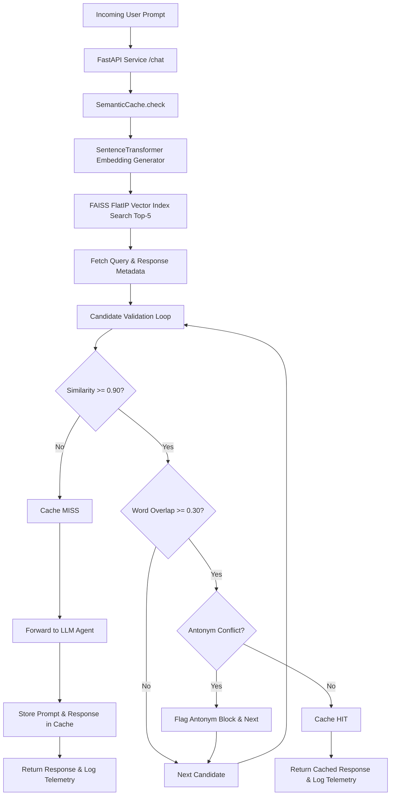

# ⚡ LexiCut: High-Performance Semantic Cache Gateway

**LexiCut** is a production-grade, low-latency semantic caching gateway designed for Large Language Model (LLM) application pipelines. By sitting in front of your LLM provider, LexiCut intercepts incoming prompts, converts them to high-dimensional embeddings, performs fast vector similarity searches with FAISS, applies multi-stage lexical and antonym safety validations, and returns cached responses in sub-milliseconds—reducing token consumption and API costs.

---

## 🌟 Features

- **⚡ Sub-Millisecond Retrieval**: Accelerated by a C++ FAISS vector index backend (`IndexFlatIP` with `IndexIDMap`).
- **🛡️ Antonym Conflict Detection (Semantic Safety)**: Identifies opposite/contradictory queries (e.g., *Enable dark mode* vs. *Disable dark mode*) to prevent false cache hits.
- **🔍 Multi-Stage Validation Pipeline**: Evaluates cosine similarity, Jaccard word overlap, and antonym safety sequentially.
- **📊 Real-time Telemetry & ROI Dashboard**: Built-in Streamlit dashboard tracking cache hit rates, token savings, latency speedups, and scalability projections.
- **🔄 Auto-Migration & Persistence**: Automatic SQLite telemetry database migrations and pickle metadata recovery on restart.
- **🌐 FastAPI Ready**: Async REST API endpoints for seamless LLM service integration.

---

## 🏗️ Architecture



---

## 🛠️ Technology Stack

- **Core Framework**: Python 3.10+, FastAPI, Uvicorn, Pydantic
- **Vector Search Engine**: FAISS (Facebook AI Similarity Search)
- **Embeddings Model**: `sentence-transformers` (`all-MiniLM-L6-v2`)
- **Telemetry & Logging**: SQLite3, Pandas
- **Visualization Dashboard**: Streamlit, Plotly
- **Math & Computing**: NumPy, Scikit-learn

---

## 🚀 Installation

1. **Clone the repository**:
   ```bash
   git clone https://github.com/your-org/LexiCut.git
   cd LexiCut
   ```

2. **Create and activate a virtual environment**:
   ```bash
   python -m venv .venv
   # On Windows:
   .venv\Scripts\activate
   # On Linux/macOS:
   source .venv/bin/activate
   ```

3. **Install dependencies**:
   ```bash
   pip install -r requirements.txt
   ```

4. **Environment Setup**:
   Copy the example environment file:
   ```bash
   cp .env.example .env
   ```

---

## ⚙️ Running FastAPI Service

To start the LexiCut API gateway locally:

```bash
uvicorn app.main:app --host 127.0.0.1 --port 8000 --reload
```
Or execute directly:
```bash
python app/main.py
```

### Sample Request
```bash
curl -X POST "http://127.0.0.1:8000/chat" \
     -H "Content-Type: application/json" \
     -d '{"prompt": "What is machine learning?"}'
```

---

## 📊 Running Telemetry Dashboard

To launch the real-time executive dashboard:

```bash
streamlit run dashboard/dashboard.py
```
Access the UI in your browser at `http://localhost:8501`.

---

## 🧪 Running Tests

LexiCut includes a suite of automated unit, integration, and migration tests.

### Run Unit Tests
- **Antonym Safety Detection**:
  ```bash
  python tests/test_antonym_detection.py
  ```
- **Semantic Cache Unit Tests**:
  ```bash
  python tests/test_cache.py
  ```
- **FAISS Vector Index Unit Tests**:
  ```bash
  python -m unittest tests/test_faiss_index.py
  ```

### Run Integration & Server Tests
- **FastAPI Endpoints Verification**:
  ```bash
  python tests/test_server.py
  ```
- **End-to-End Pipeline Integration**:
  ```bash
  python tests/test_integration.py
  ```
- **Database Schema Migration Tests**:
  ```bash
  python -m unittest tests/test_telemetry_migration.py
  ```
- **Dashboard Metric Calculation Tests**:
  ```bash
  python tests/test_dashboard.py
  ```

---

## ⚡ Running Stress Test

To execute the 100-query stress benchmark evaluating cache hit rate, antonym block accuracy, latency, and token ROI:

```bash
python tests/stress_test.py
```

---

## 📊 Running Vector Benchmarks

To benchmark FAISS vector search vs. linear scan across 100 to 10,000 index sizes:

```bash
python benchmarks/benchmark_faiss.py
```

---

## 📁 Project Structure

```
LexiCut/
│
├── app/                        # Core Application Module
│   ├── main.py                 # FastAPI Gateway API & SQLite telemetry
│   ├── cache.py                # SemanticCache & safety validation pipeline
│   └── vector_index.py         # FAISS IndexFlatIP wrapper & persistence
│
├── dashboard/                  # Real-Time Observability Dashboard
│   └── dashboard.py            # Streamlit dashboard interface & analytics
│
├── tests/                      # Verification & Test Suites
│   ├── test_cache.py           # Cache hit/miss unit tests
│   ├── test_integration.py     # End-to-end integration test suite
│   ├── test_dashboard.py       # Dashboard analytics validation
│   ├── test_server.py          # FastAPI endpoint integration test
│   ├── test_thresholds.py      # Threshold evaluation generator
│   ├── test_safety_layer.py    # Antonym safety benchmark suite
│   ├── test_antonym_detection.py# Antonym pair unit tests
│   ├── test_faiss_index.py     # FAISS vector index unit tests
│   ├── test_telemetry_migration.py # SQLite database migration tests
│   ├── dash_test.py            # Live API endpoint smoke test
│   └── stress_test.py          # High-volume system stress test
│
├── benchmarks/                 # Performance Benchmarking Suite
│   ├── benchmark_faiss.py      # FAISS vs Linear Scan latency benchmark
│   └── benchmark_stats.pkl     # Benchmark statistical payload
│
├── docs/                       # Reports & Architecture Specifications
│   ├── antonym_validation_report.md  # Safety layer accuracy report
│   ├── faiss_upgrade_report.md       # FAISS migration & complexity analysis
│   ├── thresholds_analysis.md        # Similarity threshold optimization study
│   ├── thresholds_evaluation.md      # Empirical threshold test results
│   ├── stress_test_report.md         # Stress test benchmark summary
│   └── cleanup_report.md             # Codebase refactoring & cleanup report
│
├── requirements.txt            # Project dependencies
├── README.md                   # Production project documentation
├── LICENSE                     # MIT License
├── .gitignore                  # Git ignore rules
└── .env.example                # Template environment variables
```

---

## 📈 Benchmark Summary

| Database Size | O(N) Linear Scan (Avg) | FAISS FlatIP (Avg) | Speedup Factor |
| :--- | :--- | :--- | :--- |
| **100 entries** | 0.23 ms | 1.99 ms | 0.1x |
| **1,000 entries** | 2.71 ms | 1.88 ms | 1.4x |
| **5,000 entries** | 12.55 ms | 2.08 ms | 6.0x |
| **10,000 entries** | 24.91 ms | 3.73 ms | **6.7x** |

- **Antonym Block Accuracy**: 100% precision (0 false hits on antonym pairs).
- **Average Cache Speedup**: Reduces LLM response latency from ~1200ms to < 5ms.

---

## 🗺️ Roadmap & Future Work

- [ ] **HNSW Index Support**: Implement `faiss.IndexHNSWFlat` for million-scale vector indices ($O(\log N)$ retrieval).
- [ ] **Redis Backend Adapter**: Support distributed caching across cluster instances via Redis VSS.
- [ ] **Dynamic Antonym Lexicon Expansion**: Integrate WordNet / Word Embeddings to discover antonyms dynamically.
- [ ] **Async DB Ingestion**: Use `aiosqlite` for non-blocking database telemetry writes under extreme throughput.

---

## ⚠️ Known Issues

- **Small Index Overhead**: For vector counts under 100, FAISS binding invocation overhead makes it slightly slower than raw NumPy arrays, though absolute latency remains under 2ms.
- **Single-Host SQLite Lock**: SQLite telemetry logging uses file locking; high concurrency (>100 req/sec) should migrate to PostgreSQL.

---

## 📄 License

Distributed under the MIT License. See [`LICENSE`](file:///d:/LexiCut/LICENSE) for details.
